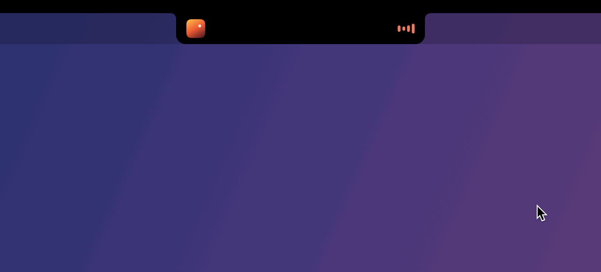
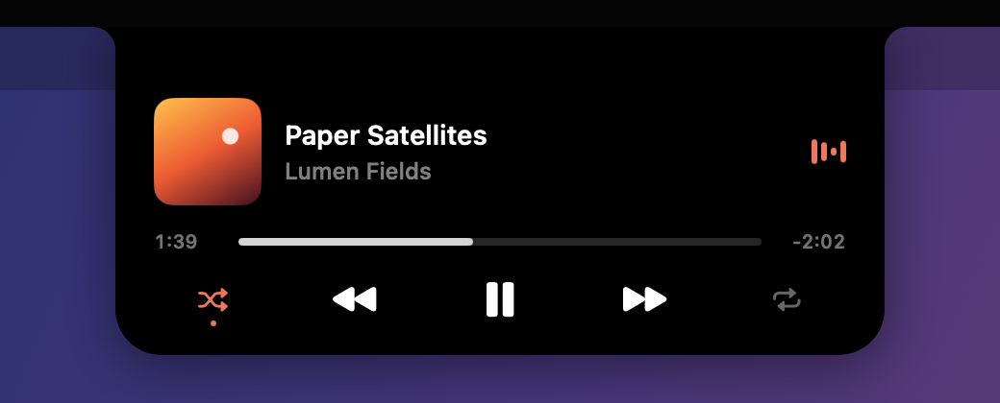
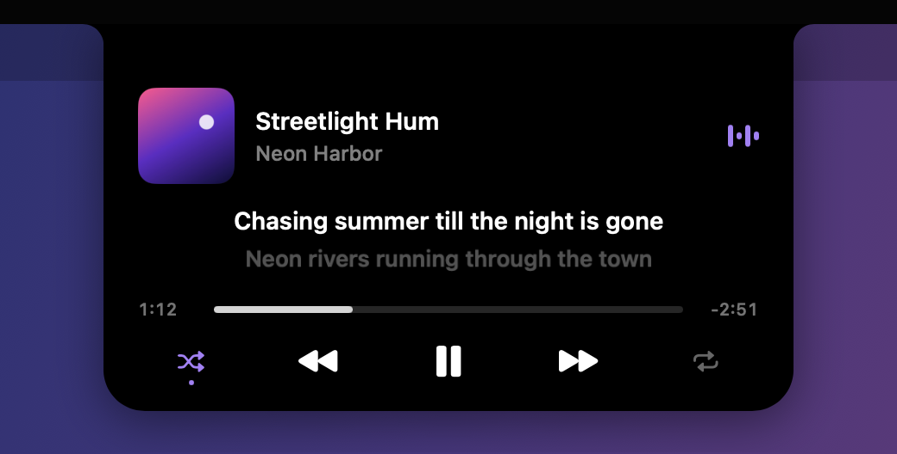
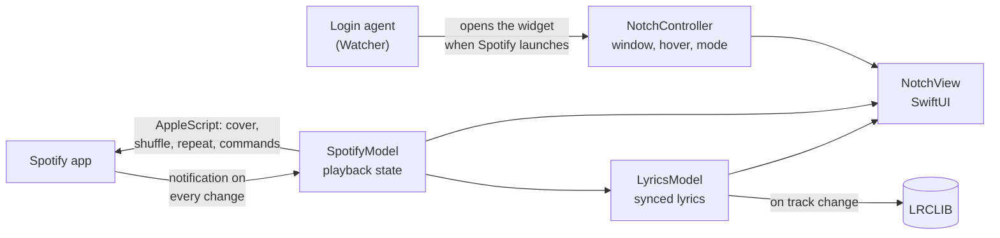

# Spotify Notch

[](https://github.com/Aidenn8/spotify-notch/actions/workflows/ci.yml)
[](https://github.com/Aidenn8/spotify-notch/releases/latest)


[](LICENSE)

Turns the notch on your MacBook into a Spotify widget: the notch shows what's
playing, and grows into a mini player when you hover over it.

<p align="center">
  
</p>

<p align="center">
  <b><a href="https://github.com/Aidenn8/spotify-notch/releases/latest/download/Spotify-Notch.dmg">⬇ Download Spotify Notch</a></b>
  · free · macOS 14+ on a MacBook with a notch
</p>

## Features

- **Closed:** the notch extends slightly to each side, with the album cover on
  the left and a pulsing visualizer on the right.
- **Open:** hover over it and it grows into a mini player with the cover, song,
  progress bar, and shuffle / previous / play-pause / next / repeat buttons.
- Colors are picked from the album cover.
- Pick the open panel's background: solid black (default) or one of four glass
  styles (smoky, frosted, clear, or tinted with the album's color).
- Optional time-synced lyrics in the open panel, scrolling up line by line
  (off by default).
- It appears when Spotify opens and disappears when Spotify quits.

<table>
  <tr>
    <td width="50%"></td>
    <td width="50%"></td>
  </tr>
  <tr>
    <td align="center"><sub>Hover to open</sub></td>
    <td align="center"><sub>With lyrics turned on</sub></td>
  </tr>
</table>

## Download

**[⬇ Download Spotify Notch](https://github.com/Aidenn8/spotify-notch/releases/latest/download/Spotify-Notch.dmg)**

You need a MacBook with a notch (Apple Silicon) on macOS 14 Sonoma or later,
and the Spotify app.

### Install

1. Open the downloaded **Spotify-Notch.dmg**.
2. Drag **Spotify Notch** into the **Applications** folder.
3. Open **Spotify Notch** from your Applications folder.
4. macOS will warn that it can't check the app for malicious software. That's
   because this is a free project that isn't registered with Apple. To allow it,
   this one time:
   - Click **Done** (or **OK**) on the warning.
   - Open **System Settings → Privacy & Security**.
   - Scroll down to the message about Spotify Notch and click **Open Anyway**,
     then confirm with your password.
5. Spotify opens and the widget appears in the notch. When macOS asks whether
   Spotify Notch can control Spotify, click **OK**.

That's it. From now on the widget shows up whenever Spotify is open, even after
restarting your Mac.

### Uninstall

Drag **Spotify Notch** from your Applications folder to the Trash. It removes
its login item by itself, so nothing is left behind.

### Updating

Download the new version, drag it into Applications (replace the old one), and
open it once.

## Tips

- Right-click the widget to change the background, turn lyrics on or off, open
  Spotify, or quit. After quitting, it comes back the next time Spotify opens.
- Lyrics come from [LRCLIB](https://lrclib.net), a free community lyrics
  database. While lyrics are on, the song's title and artist are sent there to
  look them up. Instrumentals and many covers have none, and then the panel
  looks as usual.
- Shuffle and repeat only work when music is playing on this Mac. If Spotify is
  controlling another device (for example "Playing on iPhone"), those two
  buttons can't change it.

## How it works

Written in Swift (AppKit + SwiftUI), about 1,900 lines with no dependencies.



- **Playback state** comes from the notification Spotify posts whenever
  playback changes, so nothing is polled. Cover art, shuffle and repeat are read
  with one AppleScript call per change.
- **The visualizer** is a Core Animation loop that runs in the window server,
  capped at 30 fps, so the app uses no CPU while music plays. It's a stylized
  animation, not real audio levels. In `top` the app sits at 0.0% CPU and
  about 20 MB of memory.
- **Animating the notch:** the window is only ever as big as the current shape,
  so it never blocks clicks on the menu bar. To change shape, it first grows to
  fit both the old and new shapes, SwiftUI springs between them, and the window
  is trimmed afterwards. The SwiftUI view stays pinned at its largest size the
  whole time, so resizing the window can't shift it (an early version slid in
  from the left when it opened).
- **Staying on the notch** uses private CoreGraphics/SkyLight calls to put the
  window in its own space above the desktops, so it doesn't slide when you
  switch Spaces (`Sources/StickySpace.swift`).
- **Lyrics** are fetched from LRCLIB when the song changes and timed against
  Spotify's playback position, with one timer for the next line rather than
  polling. The timers only run while the panel is open.
- **Opening with Spotify:** when you open the app it installs a small login
  agent (`Watcher/main.swift`) that waits for Spotify to launch and opens the
  widget. The widget quits when Spotify does. When the app is moved to the
  Trash, the agent removes itself.

### Project layout

```
Sources/
  main.swift              app entry: setup, one copy at a time, launch flags
  NotchController.swift   the panel window, hover handling, mode changes
  NotchView.swift         the SwiftUI widget: closed and open layouts, controls
  NotchGeometry.swift     notch detection, sizes for each mode, the notch shape
  Spotify.swift           playback state, Spotify commands, accent color from the cover
  Lyrics.swift            LRCLIB lookup, LRC parsing, line timing, the lyrics scroller
  Visualizer.swift        the Core Animation bars
  PanelStyle.swift        solid and glass backgrounds
  StickySpace.swift       private SkyLight calls that keep the window above Spaces
  Installer.swift         the login agent: setup and self-removal
  Demo.swift              made-up songs for --demo and the recording below
Watcher/main.swift        login agent that opens the widget when Spotify launches
Tests/                    XCTest: geometry, LRC parsing, lyric timing, accent colors
tools/record-demo/        renders the widget off-screen and records docs/media
tools/make-icon.swift     draws the app icon
```

## Build from source

Requires Xcode Command Line Tools (`xcode-select --install`).

```sh
git clone https://github.com/Aidenn8/spotify-notch.git
cd spotify-notch
./install.sh      # build, copy to ~/Applications and set up
./uninstall.sh    # remove it again
```

`./build.sh` builds into `build/` without installing, and `./package.sh` makes
`dist/Spotify-Notch.dmg`. `swift test` runs the tests (this needs Xcode), and
`open Package.swift` opens the project in Xcode.

Launch flags for development: `--demo` plays made-up songs without Spotify,
`--expanded` pins the panel open. `./tools/record-demo.sh` re-records the GIF,
video and screenshots in `docs/media`: it renders the real widget in an
off-screen window, plays a scripted hover, and captures every frame, so nothing
appears on screen while it runs. `tools/make-icon.swift` redraws the app icon.

## Known limitations

- Shuffle and repeat use Spotify's AppleScript interface, which can't reach
  other devices over Spotify Connect, and doesn't support Smart Shuffle or
  repeat-one.
- The private APIs used to stay fixed during Space switches are undocumented
  and could change in a future macOS release.
- The app isn't notarized by Apple, hence the one-time **Open Anyway** step.

## License

[MIT](LICENSE). Spotify Notch is an independent project and isn't affiliated
with Spotify.
